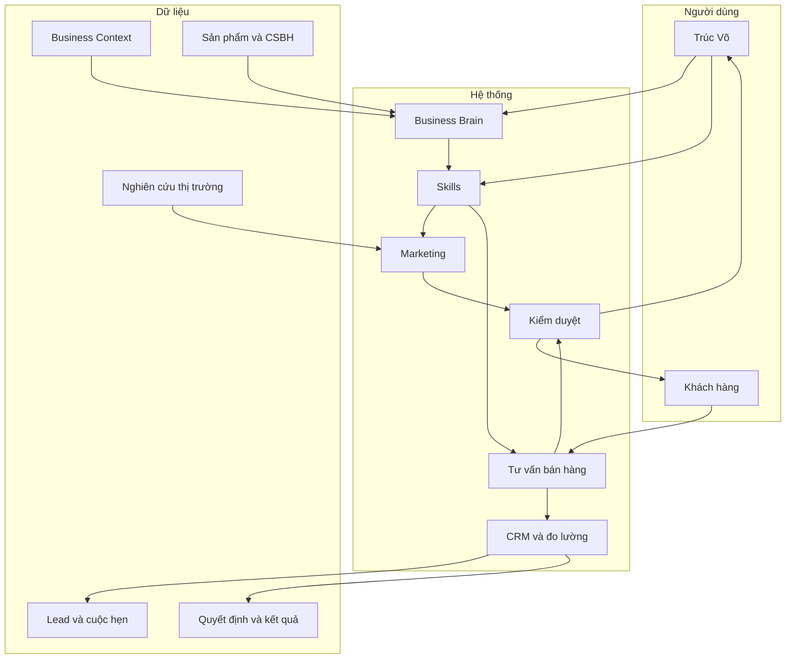

# Bản Đồ Tổng Thể Project

```mermaid
flowchart TD
  subgraph NG["Người dùng"]
    U1["Trúc Võ"]
    U2["Khách hàng"]
  end

  subgraph HT["Hệ thống"]
    S1["Business Brain"]
    S2["Skills"]
    S3["Marketing"]
    S4["Tư vấn bán hàng"]
    S5["CRM và đo lường"]
    S6["Kiểm duyệt"]
  end

  subgraph DL["Dữ liệu"]
    D1["Business Context"]
    D2["Sản phẩm và CSBH"]
    D3["Nghiên cứu thị trường"]
    D4["Lead và cuộc hẹn"]
    D5["Quyết định và kết quả"]
  end

  U1 --> S1
  U1 --> S2
  U2 --> S4
  D1 --> S1
  D2 --> S1
  D3 --> S3
  S1 --> S2
  S2 --> S3
  S2 --> S4
  S4 --> S5
  S3 --> S6
  S4 --> S6
  S5 --> D4
  S5 --> D5
  S6 --> U1
  S6 --> U2
```
